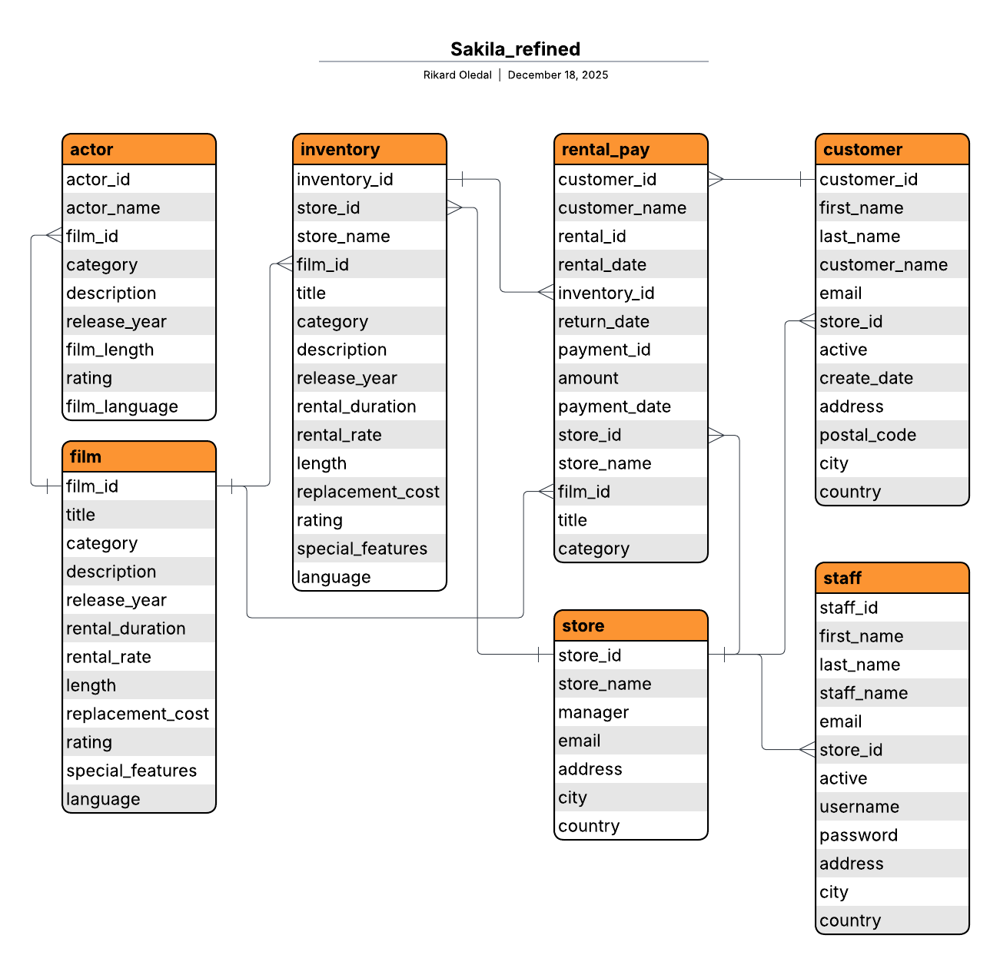
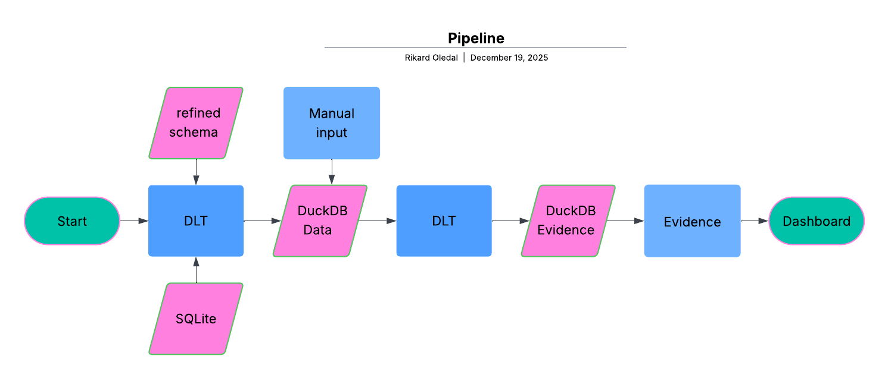

# Lab3 - SQL

The task for this Lab was to create a duckDB database from an SQLite database. The database is called Sakila and is a database with fictitious data about a company that rents movies in its two stores. For more information about Sakila, the database is available at [kaggle][1]

I would answer questions from The Manager and insert these into a Manager report in an ipynb file. Then I would also create a Dashboard in Evidence. For more information about the task follow the link below.

## Video

## Sakila DB
Sakila is a database with data about films, how many of each film there are (inventory), how much these have been rented and how much has been paid for this. There is also information about customers who rent and staff who work there.

## Sakila refined
I discovered that there would be many joins in each query if I were to use the structure that was in schema staging, so I created a refined schema with these tables.

## Data Loading Tool (DLT)
My DLT checks if there is already a DuckDB database in the data folder. If there is, DLT will not create the database. Then the DLT will run refined.sql were my refined schema and tables are added. All tables are omnipotent so they will not replace if the tables already exist.
After this, DLT will copy the database to evidence. This allows you to add data to the database manually which will then end up in Evidence.

## Evidence
I used the data from the manager report to design the dashboard in Evidence. But in Evidence I made the objects more selectable. For example, I didn't just bring up all the titles with LOVE in them, I made a movie search where you could search for any word you wanted.

## Help
I have coded everything myself, but I have a study group with Anja Scherwall and Felix Kjellberg. I have discussed a lot with them when needed. We have also helped each other with tips and logic.
I used ChatGPT and Google Gemini in troubleshooting when I didn't see the error myself. When I made the dashboard in Evidence, I looked a lot at [Evidence Docs][2].

[1]: https://www.kaggle.com/datasets/atanaskanev/sqlite-sakila-sample-database
[2]: https://docs.evidence.dev/